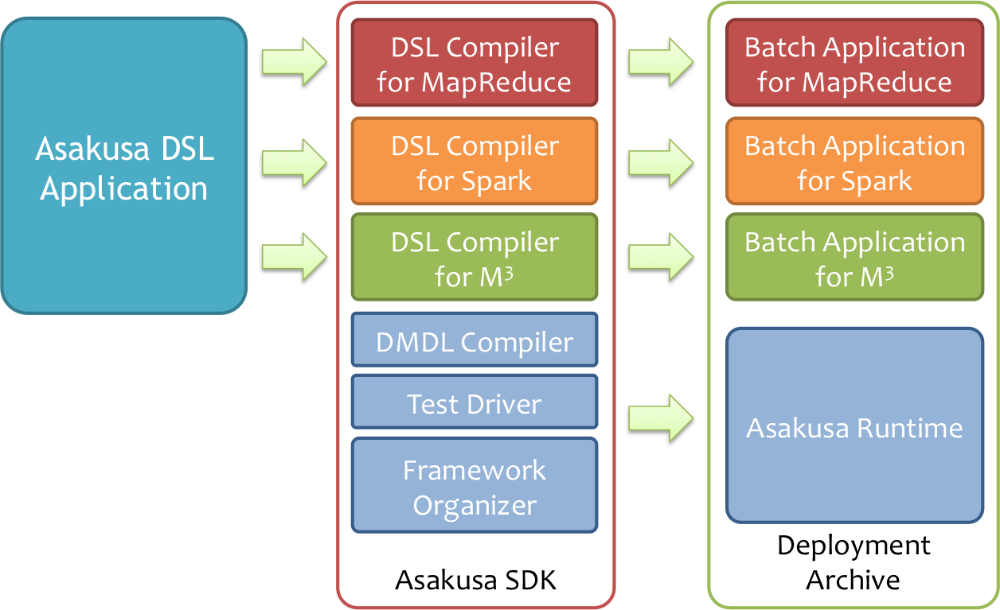
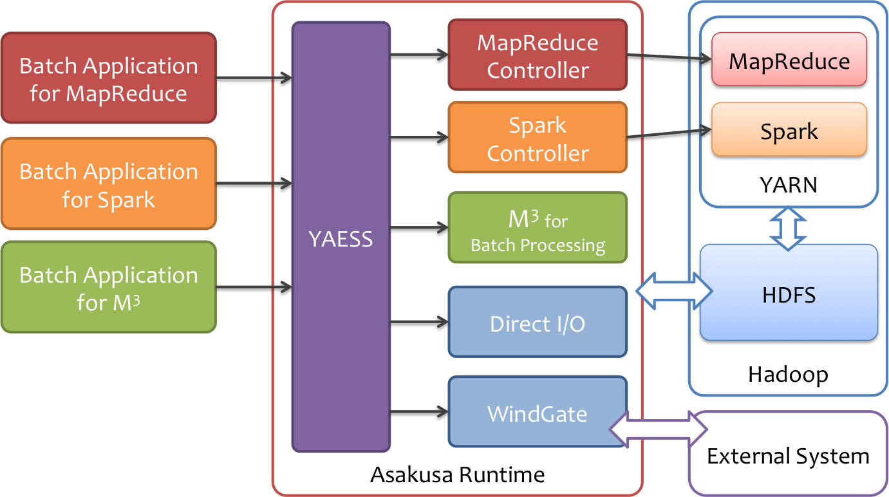

=========================
|FEATURE|\ ユーザーガイド
=========================

この文書では、\ |FEATURE|\ を利用してバッチアプリケーションをビルドし、実行する方法について説明します。

概要
====

|FEATURE|\ は、Asakusa DSLを始めとするAsakusa Frameworkの開発基盤を利用して作成したバッチアプリケーションに対して、\ |ENGINE| [#]_ をその実行基盤として利用するための機能セットを提供します。

|ENGINE|\ はDAG (Directed Acyclic Graph; 有向非循環グラフ) の形で表現されたタスクをマルチコア環境で効率よく処理するためのフレームワークで、以下のような特徴があります。

* 単一ノード上のマルチコア/マルチプロセッサ用に最適化
* 細粒度で動的なタスクスケジューリング
* ほぼすべてオンメモリで処理

上記のような特徴のため、Hadoop MapReduceやSparkに比べて、小〜中規模データサイズのバッチ処理に非常に適しています。

Asakusa Frameworkの適用領域においても、中間結果が全てメモリ上に収まる規模のバッチにおいてはAsakusa on Sparkよりも高速で、かつ高いコストパフォーマンスになることを確認しています [#]_ 。

.. [#] https://github.com/fixstars/m3bp
.. [#] http://www.asakusafw.com/techinfo/reference.html

構成
====

|FEATURE|\ を利用する場合、従来のAsakusa Frameworkが提供するDSLやテスト機構をそのまま利用して開発を行います。
アプリケーションをビルドして運用環境向けの実行モジュール（デプロイメントアーカイブ）を作成する段階ではじめて\ |FEATURE|\ のDSLコンパイラ(|COMPILER|)を利用します。

また、\ |COMPILER|\ で生成したバッチアプリケーションは、従来と同様にYAESSを利用して実行できます。
このとき、MapReduceやSparkと異なり、実行基盤にHadoopを必要としません (`Hadoopとの連携`_\ により、HDFS等を利用することもできます)。

Asakusa DSL
  従来のAsakusa DSLやDMDLで記述したバッチアプリケーションは基本的に変更なしで、\ |COMPILER|\ を利用して\ |ENGINE|\ 上で実行可能なジュールを生成することができます。

テスト機構
  従来のAsakusa DSLのテスト方法と同様に、エミュレーションモードを利用してAsakusa DSLのテストを実行することができます。このとき、\ |FEATURE|\ は特に利用しません。

アプリケーションの実行
  従来と同様、YAESSを利用してバッチアプリケーションを実行することができます。
  実行環境にMapReduce用、Spark用、\ |ENGINE|\ 用のバッチアプリケーションをすべて配置して運用することも可能です。

外部システム連携
  Direct I/OやWindGateといった外部システム連携モジュールは\ |FEATURE|\ のバッチアプリケーションでもそのまま利用することができます。

..  attention::
    |FEATURE|\ を利用する上でもWindGateなどの外部システム連携機能において、一部Hadoopの機能を利用します。

..  _target-platform:

対応プラットフォーム
====================

実行環境
--------

|FEATURE|\ は、今のところ64ビットx86アーキテクチャのLinux環境 (以下、Linux x64)上のみで動作の確認を行っています。

|FEATURE|\ のアプリケーションを実行する場合、以下または互換のソフトウェアが必要になります。

* Java SE Development Kit 8 Update 74 (Linux x64)
* GNU C++ Library 4.8.5 (``libstdc++.so.6``)
* GNU C Library 2.17 (``libc.so.6``)
* Portable Hardware Locality 1.7 (``libhwloc.so.5``) [#]_

..  hint::
    上記の構成は、Red Hat Enterprise Linux 7.2 (またはCentOS 7.2などのクローン)を想定しています。
    これらのディストリビューションを利用している場合、標準のパッケージ管理ツールで上記の一部を導入できます。

..  attention::
    WindGateなどのDirect I/O **以外** の外部連携機能を利用する場合には、実行環境に ``hadoop`` コマンドの導入が必要です。
    詳しくはそれぞれのドキュメントを参照してください。

    * :asakusafw:`データの直接入出力 - Direct I/O <directio/index.html>`
    * :asakusafw:`外部システムとの連携 - WindGate <windgate/index.html>`

..  [#] https://www.open-mpi.org/projects/hwloc/

Hadoopディストリビューション
----------------------------

|FEATURE|\ は、実行環境にインストールされたHadoopと連係して動作することもできます。

以下のような機能を利用できます。

* Direct I/O

  * 入出力データソースに、HDFSやその他のHadoopが対応しているファイルシステムを利用

* WindGate

  * HDFSを経由してWindGateの入出力を授受

|FEATURE|\ は、以下のHadoopディストリビューションと組み合わせた運用環境で動作を検証しています。

..  list-table:: 動作検証プラットフォーム(Hadoopディストリビューション)
    :widths: 3 3 3 3
    :header-rows: 1

    * - Distribution
      - Version
      - OS
      - JDK
    * - Hortonworks Data Platform
      - 2.4 (Apache Hadoop 2.7.1)
      - Red Hat Enterprise Linux 7.2
      - Java SE Development Kit 8u74
    * - MapR [#]_
      - 5.1.0 (Apache Hadoop 2.7.0)
      - CentOS 7.2
      - Java SE Development Kit 8u74

Hadoopとの連携方法は、 `Hadoopとの連携`_ を参照してください。

..  [#] |FEATURE| をMapRと連携して利用する場合において、バッチアプリケーションの起動時にデッドロックが発生しアプリケーションが実行されないことがある問題を確認しています。
        この問題の回避方法について `Hadoopとの連携`_ に記載しています。

Asakusa Framework 対応バージョン
--------------------------------

|FEATURE| バージョン |version| は、Asakusa Framework バージョン 0.8.2 を使用します。

マイグレーション
~~~~~~~~~~~~~~~~

過去の |FEATURE| バージョンを利用している開発環境、およびアプリケーションプロジェクトのバージョンアップ手順は、:asakusafw:`開発環境マイグレーションガイド <application/migration-guide.html>` を参照してください。

制限事項
--------

現在、\ |FEATURE|\ には以下の制限があります。

* 標準設定では、単一の入力グループが2GB以上になるとエラーが発生する

  * 「input group is too large; please use larger addressing mode instead」という主旨のエラーログが表示されます
  * 詳しくは :ref:`最適化設定 <optimization_properties>` の「入出力バッファのアクセス方式 (``com.asakusafw.m3bp.buffer.access``)」を参照してください

非対応機能
----------

|FEATURE|\ は、Asakusa Framework の該当バージョンで非推奨となっている機能には対応していません。

開発環境の構築
==============

バッチアプリケーションの開発環境には、従来のAsakusa Frameworkの開発環境に加え、実行環境上で動作するネイティブライブラリをビルドするための環境が必要となります。

|FEATURE|\ を利用して実行モジュールを作成するには、以下または互換のソフトウェアが必要になります。

* Java SE Development Kit 8 Update 74
* CMake 2.8 [#]_
* GNU Make 3.82 [#]_
* GNU Compiler Collection 4.8.5 (Linux x64) [#]_

  * gcc
  * g++

..  attention::
    |FEATURE|\ を利用する場合、開発環境で使用するJavaはJDK8が必要です。JDK7以下には対応していません。

..  attention::
    ビルド環境と実行環境が異なる場合、実行環境で動作するオブジェクトコードを生成するためのクロスコンパイラが必要になります。
    オブジェクトコードの生成時にはCMakeを内部的に利用しているため、クロスコンパイラの設定もCMakeの機能を利用して行うことができます。

    クロスコンパイラを導入したら、\ |COMPILER|\ のコンパイラオプション
    ``m3bp.native.cmake.CMAKE_TOOLCHAIN_FILE`` にCMakeのツールチェインファイルを指定してください。

    参考URL: https://cmake.org/Wiki/CMake_Cross_Compiling

..  [#] https://cmake.org/
..  [#] https://www.gnu.org/software/make/
..  [#] https://gcc.gnu.org/

アプリケーションの開発
======================

開発環境上で Asakusa Frameworkのバッチアプリケーションを開発し、\ |FEATURE|\ のアプリケーションをビルドする方法を見ていきます。

ここでは、 :asakusafw:`Asakusa Framework スタートガイド <introduction/start-guide.html>` などで使用しているサンプルアプリケーション「カテゴリー別売上金額集計バッチ」を\ |FEATURE|\ 向けにビルドするよう設定します。

プロジェクトテンプレートのダウンロード
--------------------------------------

|FEATURE|\ を利用する構成を持つアプリケーション開発用のプロジェクトテンプレートは、以下リンクからダウンロードします。

* `asakusa-m3bp-template-0.1.3.tar.gz <http://www.asakusafw.com/download/gradle-plugin/asakusa-m3bp-template-0.1.3.tar.gz>`_

..  _user-guide-gradle-plugin:

|FEATURE| Gradle Plugin
-----------------------

|FEATURE| Gradle Pluginは、アプリケーションプロジェクトに対して\ |FEATURE|\ のさまざまな機能を追加します。

`プロジェクトテンプレートのダウンロード`_ で説明したプロジェクトテンプレートでは、\ |FEATURE| Gradle Pluginがあらかじめ利用可能になっています。

その他のプロジェクトで \ |FEATURE| Gradle Pluginを有効にするには、アプリケーションプロジェクトのビルドスクリプト ( :file:`build.gradle` )に対して以下の設定を追加します。

* ``buildscript/dependencis`` ブロックに指定しているAsakusa Gradle Pluginの指定を\ |FEATURE| Gradle Pluginの指定に置き換える [#]_

  * ``group: 'com.asakusafw.m3bp', name: 'asakusa-m3bp-gradle', version: '0.1.3'``

* |FEATURE| Gradle Pluginを適用する定義を追加する

  * ``apply plugin: 'asakusafw-m3bp'``

以下は\ |FEATURE| Gradle Pluginの設定を追加したビルドスクリプトの例です。

..  literalinclude:: attachment/build.gradle
    :language: groovy
    :caption: build.gradle
    :name: build.gradle-user-guide-1
    :emphasize-lines: 8,15

..  [#] Asakusa on Sparkと\ |FEATURE|\ を同時に利用する場合は、Asakusa on Spark Gradle Plugin の設定と\ |FEATURE| Gradle Plugin の両方を記述します。

アプリケーションのビルド
------------------------
:ref:`user-guide-gradle-plugin` を設定した状態で、Gradleタスク :program:`m3bpCompileBatchapps` を実行すると、\ |FEATURE|\ 向けのバッチアプリケーションのビルドを実行します。

..  code-block:: sh

    ./gradlew m3bpCompileBatchapps

:program:`m3bpCompileBatchapps` タスクを実行すると、アプリケーションプロジェクトの :file:`build/m3bp-batchapps` 配下にビルド済みのバッチアプリケーションが生成されます。

標準の設定では、\ |FEATURE|\ のバッチアプリケーションは接頭辞に ``m3bp.`` が付与されます。
例えば、サンプルアプリケーションのバッチID ``example.summarizeSales`` の場合、\ |FEATURE|\ のバッチアプリケーションのバッチIDは ``m3bp.example.summarizeSales`` となります。

..  seealso::
    |COMPILER|\ で利用可能な設定の詳細は、 :doc:`reference` を参照してください。

デプロイメントアーカイブの生成
------------------------------

:ref:`user-guide-gradle-plugin` を設定した状態で、Asakusa Frameworkのデプロイメントアーカイブを作成すると、\ |FEATURE|\ のバッチアプリケーションアーカイブを含むデプロイメントアーカイブを生成します。

デプロイメントアーカイブを生成するには Gradleの :program:`assemble` タスクを実行します。

..  code-block:: sh

    ./gradlew assemble

..  hint::
    Shafuを利用する場合は、プロジェクトを選択してコンテキストメニューから :menuselection:`Jinrikisha (人力車) --> Asakusaデプロイメントアーカイブを生成` を選択します。

Hadoopとの連携
--------------

`デプロイメントアーカイブの生成`_\ を行う際に、以下のいずれかの設定を行うことで、実行環境にインストール済みのHadoopと連携するデプロイメントアーカイブを生成します。

* ``asakusafwOrganizer.m3bp.useSystemHadoop true``
* ``asakusafwOrganizer.profiles.<プロファイル名>.m3bp.useSystemHadoop true``

以下は、 ``prod`` プロファイルのデプロイメントアーカイブに上記の設定を行う例です。

..  literalinclude:: attachment/build-system-hadoop.gradle
    :language: groovy
    :caption: build.gradle
    :name: build.gradle-user-guide-2
    :emphasize-lines: 19

..  warning::
    多くのHadoopコマンドは、Java VMのヒープ容量の最大値に非常に小さな値を標準で指定します。
    この設定を上書きする方法は、 :ref:`ASAKUSA_M3BP_OPTS` を参照してください。

なお、実行環境にインストールされたHadoopを利用する際、以下の順序で ``hadoop`` コマンドを探して利用します (上にあるものほど優先度が高いです)。

* 環境変数に ``HADOOP_CMD`` が設定されている場合、 ``$HADOOP_CMD`` コマンドを経由して起動します。
* 環境変数に ``HADOOP_HOME`` が設定されている場合、 :file:`$HADOOP_HOME/bin/hadoop` コマンドを経由して起動します。
* :program:`hadoop` コマンドのパスが通っている場合、 :program:`hadoop` コマンドを経由して起動します。

..  attention::
    MapRなどの一部の環境で ``useSystemHadoop true`` を利用した際に、バッチアプリケーション起動時にデッドロックが発生しアプリケーションが正しく実行されないことがある問題が確認されています。
    これを回避するには、 ``build.gradle`` に以下の設定を加えてください

    ..  code-block:: groovy
        :caption: build.gradle
        :name: build.gradle-user-guide-3

        asakusafwOrganizer {
            extension {
                libraries += ["com.asakusafw.m3bp.bridge:asakusa-m3bp-workaround-hadoop:0.1.3"]
            }
        }

..  attention::
    Hadoopと連携してバッチアプリケーションを実行した際に、利用する環境によってはバッチアプリケーションのログがHadoopのログ設定の上で出力される可能性があります。

    \ |FEATURE|\ のログ設定を優先したい場合は、環境変数 ``HADOOP_USER_CLASSPATH_FIRST=true`` を設定してください。

アプリケーションの実行
======================

ここでは、\ |FEATURE|\ 固有の実行環境の設定について説明します。

Asakusa Frameworkの実行環境の構築方法やバッチアプリケーションを実行する方法の基本的な流れは、 :asakusafw:`Asakusa Framework デプロイメントガイド <administration/deployment-guide.html>` などを参照してください。

バッチアプリケーションの実行
----------------------------

デプロイしたバッチアプリケーションをYAESSを使って実行します。

:program:`$ASAKUSA_HOME/yaess/bin/yaess-batch.sh` コマンドに実行するバッチIDとバッチ引数を指定してバッチを実行します。
標準の設定では、\ |FEATURE|\ のバッチアプリケーションはバッチIDの接頭辞に ``m3bp.`` が付与されているので、このバッチIDを指定します。

..  attention::
    標準の設定では、バッチIDの接頭辞に ``m3bp.`` がついていないバッチIDは従来のHadoop MapReduce向けバッチアプリケーションです。YAESSの実行時にバッチIDの指定を間違えないよう注意してください。

例えば、サンプルアプリケーションを実行する場合は、以下のように :program:`yaess-batch.sh` を実行します。

..  code-block:: sh

    $ASAKUSA_HOME/yaess/bin/yaess-batch.sh m3bp.example.summarizeSales -A date=2011-04-01

..  seealso::
    サンプルアプリケーションのデプロイやデータの配置、実行結果の確認方法などは、 :asakusafw:`Asakusa Framework スタートガイド - サンプルアプリケーションの実行 <introduction/start-guide.html#startguide-running-example>` を参照してください。

..  attention::
    |FEATURE|\ ではメモリ上に中間データを配置するため、入力データが膨大であったり中間データが膨らむようなバッチ処理では、メモリ容量が不足してしまう場合があります。この場合、バッチ処理はエラーにより中断されます。

    空きメモリ容量を増やすか、またはAsakusa on Sparkなどの利用を検討してください。

    この制約は将来緩和される可能性があります。
